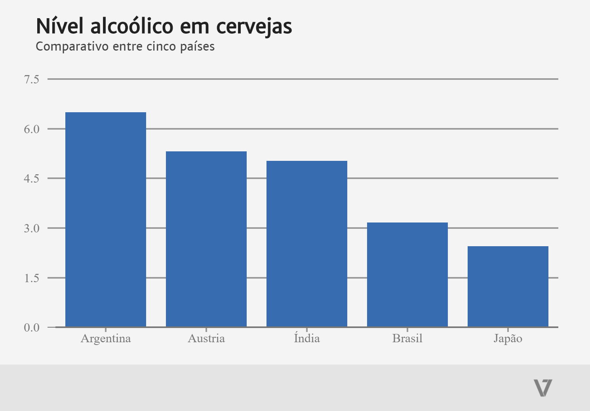

# Argentina tem cervejas com maior nível alcoólico em relação ao Brasil

Em comparação com Índia, Áustria, Japão e Brasil, as cervejas argentinas

### [Fonte original] (https://github.com/brewdega/open-beer-database-dumps)
